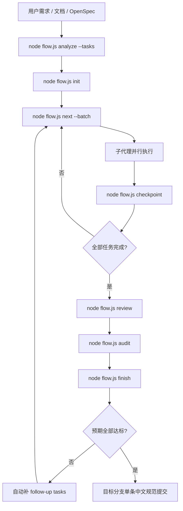
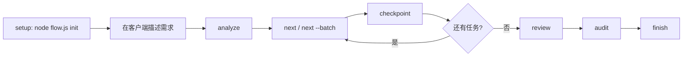
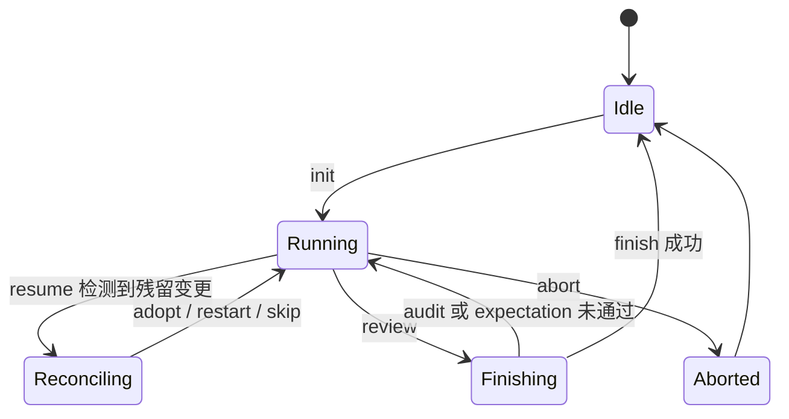
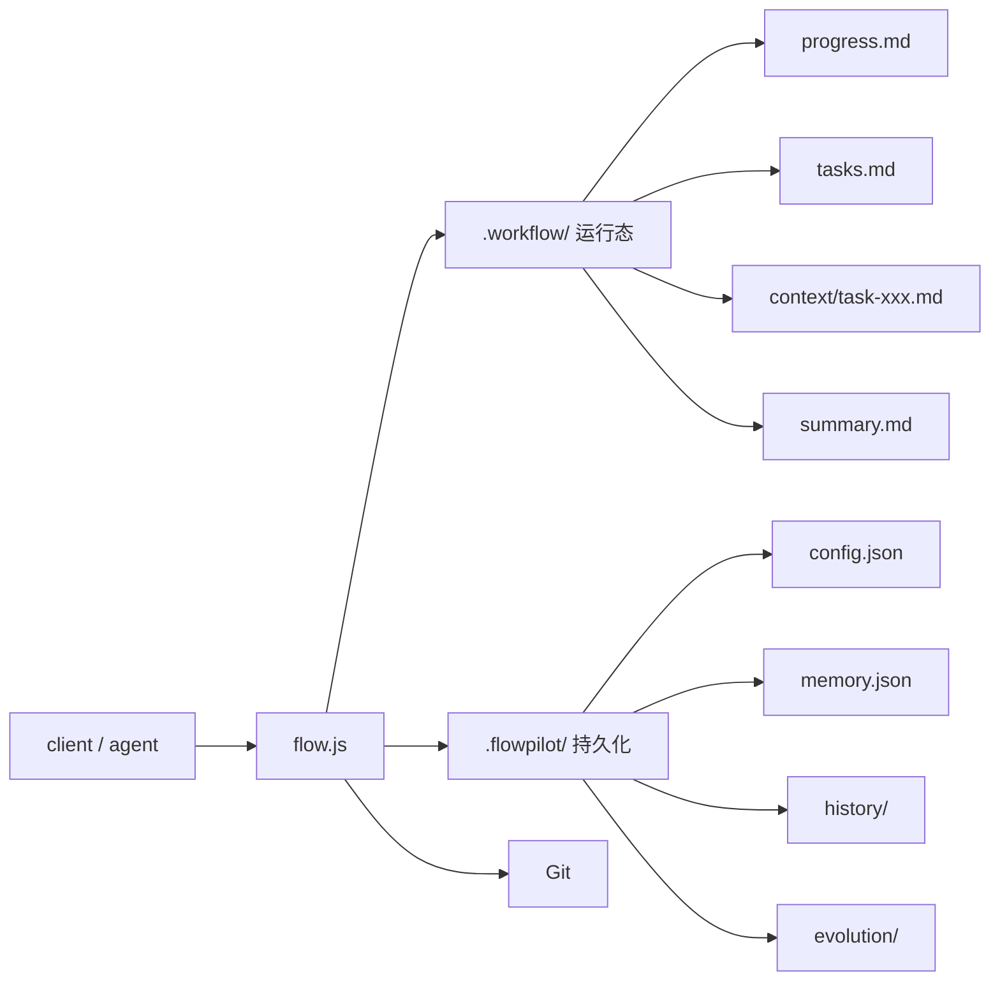
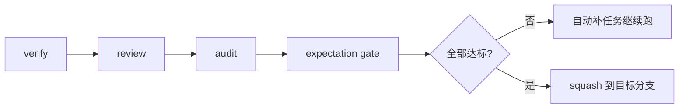

# NewFlow

**一个文件，把需求变成任务、代码、验证和最终提交。**

**基于 FlowPilot 开发。**

NewFlow 是一个基于 FlowPilot 开发、面向 `Claude Code`、`Codex`、`Cursor`、`snow-cli` 等客户端的自动工作流调度器。  
它负责：

- 自动分析需求并生成任务
- 自动融合 OpenSpec
- 并行派发子任务
- 记录 checkpoint、长期记忆和运行状态
- 在收尾时执行 `review -> audit -> expectation gate -> 最终提交`
- 让目标分支最终只留下**一条中文规范提交**

## 一图看懂



## 快速开始

### 1. 构建并复制

```bash
cd NewFlow
npm install
npm run build

cp dist/flow.js /your/project/
cd /your/project
```

### 2. 初始化项目

```bash
node flow.js init
```

这一步会：

- 选择客户端类型
- 生成 `AGENTS.md` / `CLAUDE.md` / `ROLE.md`
- 写入 NewFlow 协议（继承 FlowPilot 工作流能力）
- 初始化本地运行状态目录

### 3. 启动客户端并直接提需求

| 客户端 | 需要开启 | 建议启动方式 |
|---|---|---|
| `Claude Code` | Agent Teams | `claude --dangerously-skip-permissions` |
| `Codex` | `multi_agent = true` | `codex --yolo` |
| `Cursor` | `Agents` + `Run Everything` | 打开项目后直接继续 |
| `snow-cli` | Agent 环境 | 按你的现有方式启动 |

然后直接说你的需求，例如：

```text
帮我做一个电商系统，包含用户注册、商品管理、购物车和订单支付
```

## 纯 CLI 用法

如果你想先在命令行里看分析结果：

```bash
echo "实现支付回调与重试" | node flow.js analyze --tasks
```

如果你想直接用分析结果启动工作流：

```bash
echo "实现支付回调与重试" | node flow.js analyze --tasks | node flow.js init
```

拿到任务后继续执行：

```bash
node flow.js next --batch
```

完成任务后提交 checkpoint：

```bash
echo "[REMEMBER] 完成支付回调并补充幂等处理" | node flow.js checkpoint 001 --files src/pay.ts src/order.ts
```

## 使用方法总结

### 推荐日常流程



### 工作流状态



### 规划输入优先级

| 优先级 | 来源 | 说明 |
|---|---|---|
| 1 | 显式传入的任务列表 | 你直接 pipe 给 `init` 的内容 |
| 2 | `openspec/changes/*/tasks.md` | 自动选择最近活跃的 OpenSpec 任务文件 |
| 3 | OpenSpec proposal/spec/design | 自动作为分析上下文 |
| 4 | 内置分析器 | `node flow.js analyze --tasks` 自动生成 |

## 常用命令

### 规划与启动

| 命令 | 作用 |
|---|---|
| `node flow.js init` | 初始化项目或直接接收任务列表启动工作流 |
| `node flow.js analyze --tasks` | 自动分析需求并生成任务 Markdown |
| `node flow.js analyze --task <id>` | 输出单个任务的目标、假设、风险和建议验证项 |
| `node flow.js add <描述> [--type ...]` | 在运行中追加任务 |

### 执行与恢复

| 命令 | 作用 |
|---|---|
| `node flow.js next` | 获取下一个任务 |
| `node flow.js next --batch` | 获取一批可并行任务 |
| `node flow.js checkpoint <id> --files ...` | 记录任务完成并声明修改文件 |
| `node flow.js pulse <id> --phase ...` | 上报任务进展 |
| `node flow.js resume` | 中断恢复 |
| `node flow.js adopt <id> --files ...` | 接管中断后残留的 task-owned 变更 |
| `node flow.js restart <id>` | 让任务从头重做 |
| `node flow.js skip <id>` | 跳过任务 |
| `node flow.js rollback <id>` | 回滚到指定任务 |
| `node flow.js status` | 查看全局状态 |

### 收尾与学习

| 命令 | 作用 |
|---|---|
| `node flow.js review` | 标记 code review 已完成 |
| `node flow.js audit` | 检查重复修改和问题引入 |
| `node flow.js finish` | 执行最终收尾 |
| `node flow.js recall <关键词>` | 查询长期记忆 |
| `node flow.js evolve` | 应用反思结果 |
| `node flow.js abort` | 中止当前工作流 |
| `node flow.js version` | 查看版本 |

## 目录结构



### 这几个文件分别干什么

| 路径 | 用途 |
|---|---|
| `.workflow/progress.md` | 主代理只读的当前任务状态 |
| `.workflow/tasks.md` | 当前工作流任务定义 |
| `.workflow/context/task-xxx.md` | 单任务产出和决策 |
| `.workflow/summary.md` | 滚动摘要 |
| `.flowpilot/config.json` | 持久配置 |
| `.flowpilot/memory.json` | 长期记忆 |
| `.flowpilot/history/` | 历史统计 |
| `.flowpilot/evolution/` | Reflect / Experiment / Review 记录 |

## Git 策略

### 现在的 Git 行为

| 项目 | 策略 |
|---|---|
| 任务级提交 | 只存在于内部运行分支 |
| 目标分支历史 | 最终只保留一条中文规范提交 |
| 提交风格 | 中文 Conventional Commits 风格 |
| 提交正文 | 自动列出变更摘要、详细修改、涉及文件、验证与验收结果 |

### 收尾门禁



这意味着：

- `finish` 不再只是“跑测试”
- 如果检测到重复修改、问题引入或预期未达成，工作流不会结束
- 只有所有门禁通过，才会生成最终提交并回到待命状态

## OpenSpec 集成

NewFlow 已将 OpenSpec 作为一等输入源：

- 有 `tasks.md` 时优先直接使用
- 只有 proposal/spec/design 时会自动融合为分析上下文
- OpenSpec checkbox 任务格式会被自动识别
- 最终 expectation gate 会优先参考 OpenSpec 中的验收信息

## 适合什么场景

| 场景 | 是否适合 |
|---|---|
| 多任务、可并行的功能开发 | 很适合 |
| 容易中断、需要恢复的长流程开发 | 很适合 |
| 需要保留长期记忆和阶段产出的项目 | 很适合 |
| 想把最终 Git 历史压成干净提交 | 很适合 |
| 只想临时改一行代码 | 不一定值得上完整工作流 |

## 最短上手清单

1. `npm run build`
2. `cp dist/flow.js /your/project/`
3. `cd /your/project && node flow.js init`
4. 启动客户端
5. 直接描述需求
6. 需要恢复时运行 `node flow.js resume`
7. 收尾时依次经过 `review -> audit -> finish`

## 备注

- 本项目要求在支持 Agent Teams / 多代理执行的环境里使用。
- 运行时只依赖 Node.js 内置模块；构建与测试使用开发依赖。
