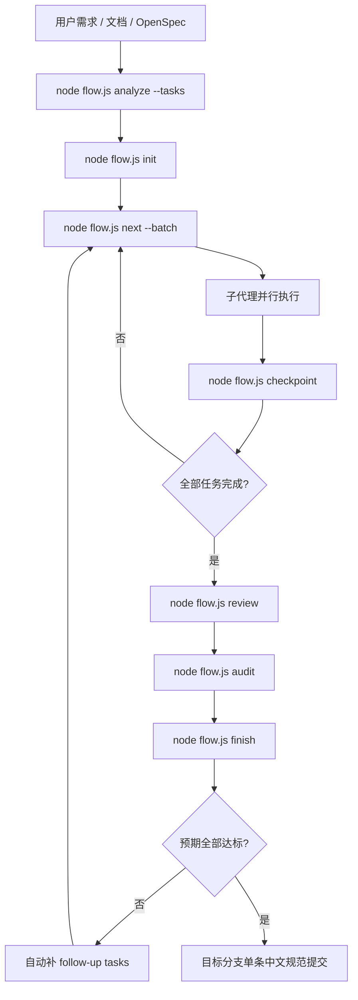

# NewFlow

**一个文件，把需求变成任务、代码、验证和最终提交。**

**基于 [FlowPilot](https://github.com/6BNBN/FlowPilot) 开发。**

NewFlow 是一个面向 `Claude Code`、`Codex`、`Cursor`、`snow-cli` 等客户端的自动工作流调度器。  
它会自动分析需求、融合 OpenSpec、并行派发任务、记录 checkpoint、执行 `review -> audit -> expectation gate`，并在目标分支最终生成一条中文规范提交。

## 快速启动

### 1. 构建并复制

```bash
cd NewFlow
npm install
npm run build

cp dist/flow.js /your/project/
cd /your/project
```

### 2. 初始化

```bash
node flow.js init
```

### 3. 启动客户端并描述需求

| 客户端 | 需要开启 | 建议启动方式 |
|---|---|---|
| `Claude Code` | Agent Teams | `claude --dangerously-skip-permissions` |
| `Codex` | `multi_agent = true` | `codex --yolo` |
| `Cursor` | `Agents` + `Run Everything` | 打开项目后直接继续 |
| `snow-cli` | Agent 环境 | 按你的现有方式启动 |

例如：

```text
帮我做一个电商系统，包含用户注册、商品管理、购物车和订单支付
```

### 4. 最短上手清单

1. `npm run build`
2. `cp dist/flow.js /your/project/`
3. `cd /your/project && node flow.js init`
4. 启动客户端
5. 直接描述需求
6. 需要恢复时运行 `node flow.js resume`
7. 收尾时依次经过 `review -> audit -> finish`

## 文档导航

| 文档 | 适合谁看 | 内容 |
|---|---|---|
| [快速上手](docs/quick-start.md) | 第一次用的人 | 环境准备、初始化、恢复、常见操作 |
| [总览](docs/overview.md) | 想快速理解整体的人 | 工作流图、状态图、目录结构、Git 策略、OpenSpec 集成 |
| [使用说明](docs/usage-guide.md) | 需要细节的人 | 命令参考、输入格式、并行开发、finish 语义、常见问题 |

## 一图看懂



## 常用命令

| 命令 | 作用 |
|---|---|
| `node flow.js init` | 初始化项目或直接接收任务列表启动工作流 |
| `node flow.js analyze --tasks` | 自动分析需求并生成任务 Markdown |
| `node flow.js next --batch` | 获取一批可并行任务 |
| `node flow.js checkpoint <id> --files ...` | 记录任务完成并声明修改文件 |
| `node flow.js resume` | 中断恢复 |
| `node flow.js review` | 标记 code review 已完成 |
| `node flow.js audit` | 检查重复修改和问题引入 |
| `node flow.js finish` | 执行最终收尾 |
| `node flow.js status` | 查看全局状态 |

## 纯 CLI 例子

```bash
echo "实现支付回调与重试" | node flow.js analyze --tasks | node flow.js init
node flow.js next --batch
echo "[REMEMBER] 完成支付回调并补充幂等处理" | node flow.js checkpoint 001 --files src/pay.ts src/order.ts
```

## 备注

- 本项目要求在支持 Agent Teams / 多代理执行的环境里使用。
- 运行时只依赖 Node.js 内置模块；构建与测试使用开发依赖。