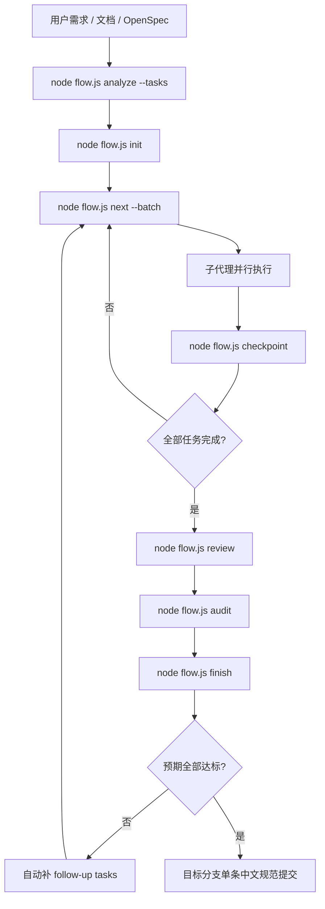
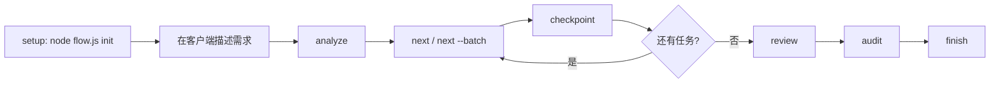
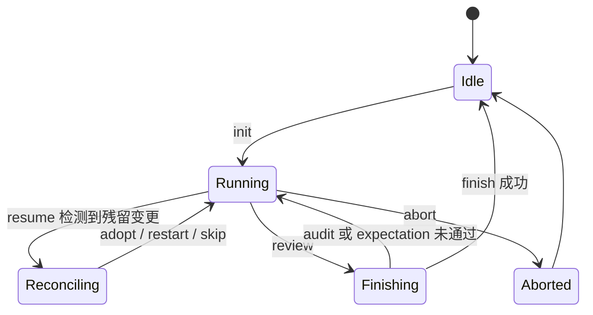
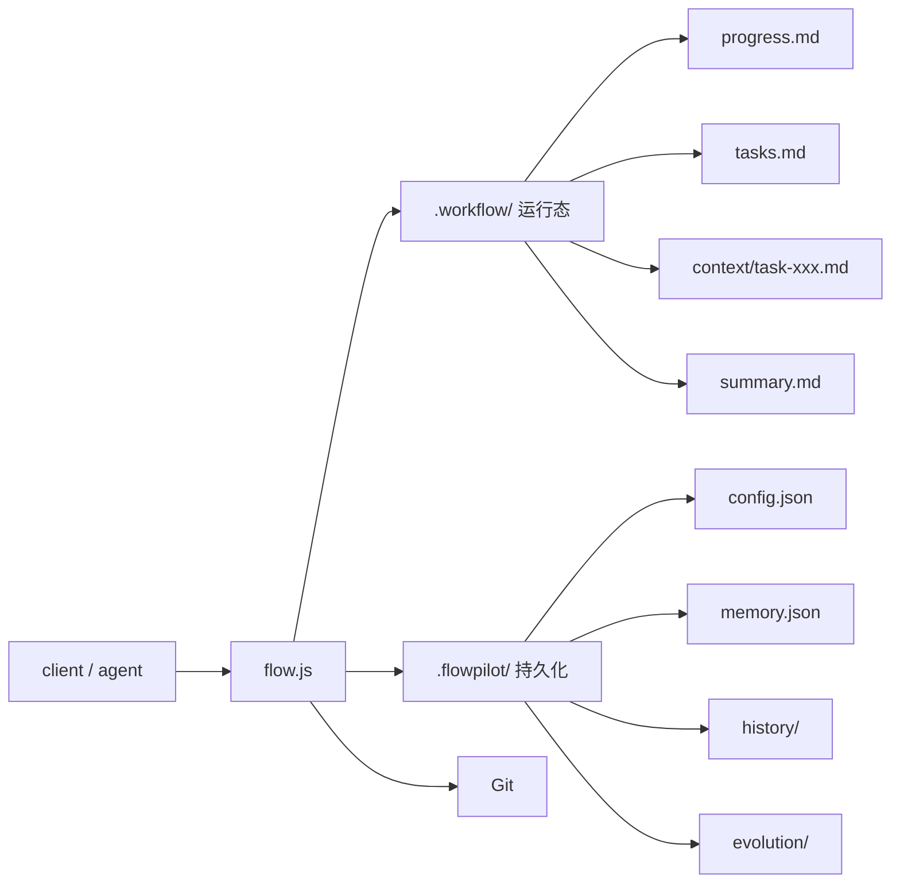
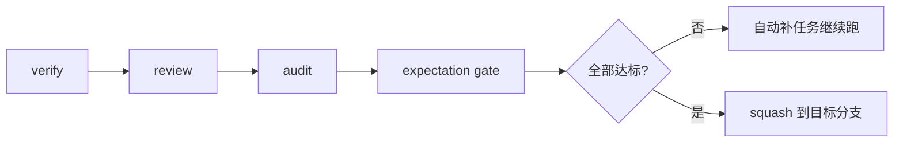

# NewFlow 总览

## 一图看懂

## 推荐日常流程

## 工作流状态

## 规划输入优先级

| 优先级 | 来源 | 说明 |
|---|---|---|
| 1 | 显式传入的任务列表 | 你直接 pipe 给 `init` 的内容 |
| 2 | `openspec/changes/*/tasks.md` | 自动选择最近活跃的 OpenSpec 任务文件 |
| 3 | OpenSpec proposal/spec/design | 自动作为分析上下文 |
| 4 | 内置分析器 | `node flow.js analyze --tasks` 自动生成 |

## 目录结构

| 路径 | 用途 |
|---|---|
| `.workflow/progress.md` | 主代理只读的当前任务状态 |
| `.workflow/tasks.md` | 当前工作流任务定义 |
| `.workflow/context/task-xxx.md` | 单任务产出和决策 |
| `.workflow/summary.md` | 滚动摘要 |
| `.flowpilot/config.json` | 持久配置 |
| `.flowpilot/memory.json` | 长期记忆 |
| `.flowpilot/history/` | 历史统计 |
| `.flowpilot/evolution/` | Reflect / Experiment / Review 记录 |

## Git 策略

### 当前行为

| 项目 | 策略 |
|---|---|
| 任务级提交 | 只存在于内部运行分支 |
| 目标分支历史 | 最终只保留一条中文规范提交 |
| 提交风格 | 中文 Conventional Commits 风格 |
| 提交正文 | 自动列出变更摘要、详细修改、涉及文件、验证与验收结果 |

### 收尾门禁

这意味着：

- `finish` 不再只是“跑测试”
- 如果检测到重复修改、问题引入或预期未达成，工作流不会结束
- 只有所有门禁通过，才会生成最终提交并回到待命状态

## OpenSpec 集成

NewFlow 已将 OpenSpec 作为一等输入源：

- 有 `tasks.md` 时优先直接使用
- 只有 proposal/spec/design 时会自动融合为分析上下文
- OpenSpec checkbox 任务格式会被自动识别
- 最终 expectation gate 会优先参考 OpenSpec 中的验收信息

## 适合什么场景

| 场景 | 是否适合 |
|---|---|
| 多任务、可并行的功能开发 | 很适合 |
| 容易中断、需要恢复的长流程开发 | 很适合 |
| 需要保留长期记忆和阶段产出的项目 | 很适合 |
| 想把最终 Git 历史压成干净提交 | 很适合 |
| 只想临时改一行代码 | 不一定值得上完整工作流 |
